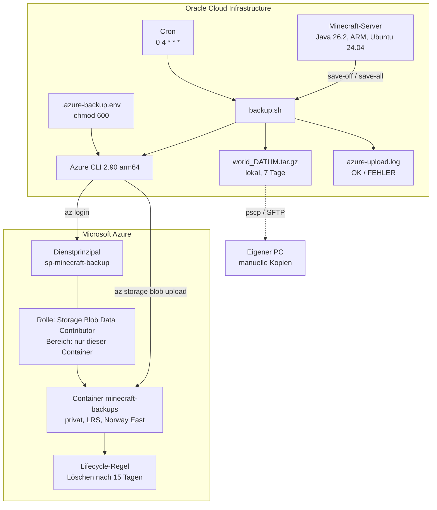
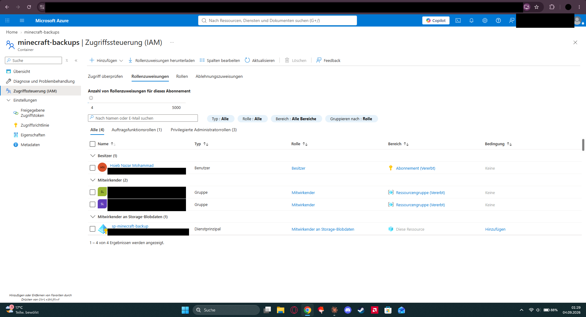
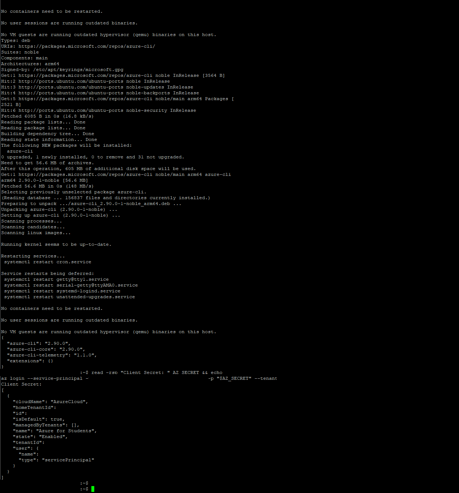
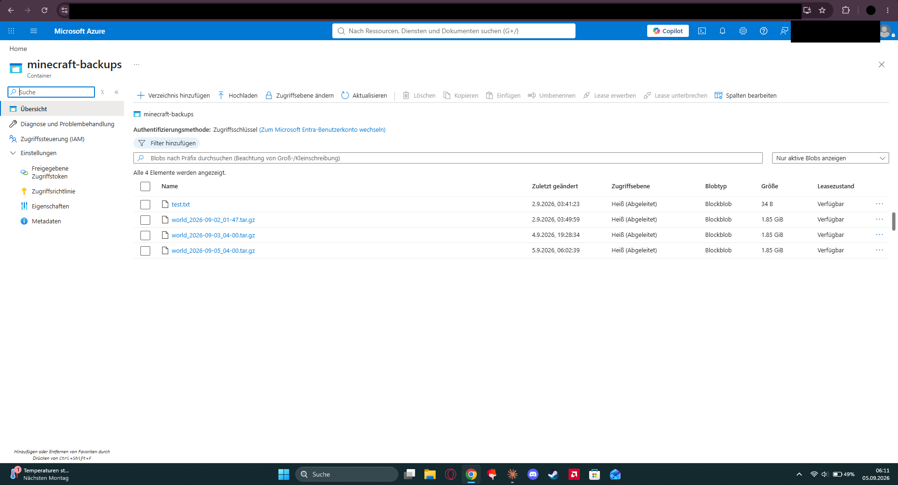

# Offsite-Backup meines Minecraft-Servers von Oracle Cloud nach Azure

Oracle hat mein Konto gesperrt. Sechs Tage lang kam ich weder an den Server noch an die Backups, weil beides am selben Ort lag. Danach habe ich das Backup zu einem zweiten Anbieter geschoben.

Privates Projekt, acht Leute spielen drauf. Klein, aber einmal richtig schiefgegangen.

## Was passiert ist

Seit dem 15.08.2026 läuft ein Minecraft-Server (Java 26.2) für acht Freunde bei Oracle Cloud auf einer Always-Free-Instanz. ARM, Ubuntu 24.04, alles selbst aufgesetzt. Ein Backup lief schon: Cron um 4 Uhr nachts, Welt als `tar.gz`, sieben Tage aufheben. Nur lag das alles auf derselben Instanz.

Am 21.08.2026 war das Konto gesperrt, ohne Vorwarnung. Kein Server, keine Web-Konsole, keine Backups. Außerhalb hatte ich nur eine Kopie vom 18.08. mit 427 MB, und die Welt war da längst größer. Am 26.08. hat Oracle das Konto von selbst wieder freigeschaltet. Sonst wären ein paar Tage Fortschritt weg gewesen.

> Ein Backup beim selben Anbieter wie der Server ist kein Backup. Eine Kontosperre nimmt dir beides auf einmal.

## Wie ich es gelöst habe

Jedes Archiv aus der Nacht geht zusätzlich nach Azure Blob Storage. Anderer Anbieter, eigener Login, eigene Rechnung.

| Ebene | Ort | Aufbewahrung |
|---|---|---|
| 1 | Lokal auf der Oracle-Instanz | 7 Tage |
| 2 | Azure Blob Storage | 15 Tage, per Lifecycle-Regel |
| 3 | Kopien auf meinem PC | wenn ich dran denke |

Ebene 1 ist für den normalen Fall, kaputtes Update oder gelöschte Basis. Ebene 2 ist für den Fall aus dem August. Ebene 3 falls beide Konten gleichzeitig weg sind.

## Architektur



## Aufbau

1. Speicherkonto in Norway East, LRS, StorageV2. Darin der Container `minecraft-backups`, privat, öffentlicher Zugriff aus.
2. App-Registrierung `sp-minecraft-backup` in Entra ID, dazu ein Clientschlüssel mit 24 Monaten Laufzeit.
3. Rolle `Storage Blob Data Contributor` auf den Container geben, nicht auf das Speicherkonto.
4. Azure CLI auf den Server. arm64 kommt direkt aus dem Microsoft-Repo.
5. Zugangsdaten nach `/home/ubuntu/.azure-backup.env`, Vorlage steht in [`.env.example`](.env.example), danach `chmod 600`.
6. Upload-Block an das vorhandene `backup.sh` dranhängen, siehe [`scripts/backup.sh`](scripts/backup.sh).
7. Lifecycle-Regel `delete-old-backups`: Präfix `minecraft-backups/`, seit 15 Tagen nicht geändert, Blob löschen.
8. Restore testen.

Der ganze Klickweg mit allen Befehlen steht in [`docs/SETUP.md`](docs/SETUP.md).

## Warum ich es so gemacht habe

**Dienstprinzipal statt Kontoschlüssel.** Der Kontoschlüssel darf alles im ganzen Speicherkonto und würde dauerhaft auf einem Server liegen, der offen im Netz hängt. Der Dienstprinzipal ist eine eigene Identität mit genau einer Berechtigung. Wenn mir jemand den Server übernimmt, kommt er an einen Container mit Minecraft-Archiven und sonst an nichts.

**Rolle auf dem Container, nicht auf dem Speicherkonto.** Beides geht. Auf Kontoebene wäre es ein Klick weniger gewesen. Dann hätte der Server aber automatisch Zugriff auf jeden Container, den ich später anlege. Sowas wächst still mit und fällt keinem auf.

**Voller Pfad `/usr/bin/az` im Skript.** Cron startet mit einem sehr kurzen `PATH`. Ein Skript, das ich von Hand starte, läuft, im Cron kommt dann `az: command not found`.

**Logfile mit OK und FEHLER pro Lauf.** Ein Upload, der still scheitert, ist schlimmer als gar keiner, weil man sich in Sicherheit wiegt. Das Skript schreibt pro Lauf eine Zeile mit Zeitstempel und schiebt `stderr` der Azure-Befehle in dieselbe Datei. Anmeldefehler und Upload-Fehler stehen getrennt drin.

**Secret beim Einrichten mit `read -rsp` eingeben.** Wenn ich es direkt in den Befehl tippe, steht es danach in `~/.bash_history`:

```bash
read -rsp "Client Secret: " AZ_SECRET && echo
az login --service-principal -u "<APP-ID>" -p "$AZ_SECRET" --tenant "<TENANT-ID>"
```

In der History steht dann `"$AZ_SECRET"` und nicht der Wert.

**15 Tage statt 30.** Ein Archiv ist knapp 2 GB groß. 15 Stände sind rund 30 GB statt 60. Dafür ist mein Rückholfenster kürzer: wenn mir ein Schaden erst nach zwei Wochen auffällt, ist auch der letzte saubere Stand weg. Bei acht Leuten, die regelmäßig spielen, merkt man fehlende Bauten aber nach ein paar Tagen. Wäre der Server ruhiger, würde ich anders rechnen.

**Norway East statt Germany West Central.** Mein Abo `Azure for Students` hat eine Deny-Richtlinie (`sys.regionrestriction`) und lässt nur fünf Regionen zu:

```
Resource was disallowed by Azure: This policy maintains a set of best
available regions where your subscription can deploy resources.
(Code: RequestDisallowedByAzure)
```

Für ein privates Backup ist mir egal, wo in der EU es liegt. Produktiv würde man die Region bewusst wählen, wegen Latenz und Datenhaltung. Dieselbe Richtlinie plus fehlendes vCPU-Kontingent blockiert in dem Abo übrigens jede VM. Storage braucht kein Kontingent, deshalb geht dieser Weg trotzdem.

## Nachweise

Zugangsdaten und Kennnummern auf den Bildern sind geschwärzt.



Die Rolle "Mitwirkender an Storage-Blobdaten" hängt am Dienstprinzipal, Bereich "Diese Ressource", also am Container.



`"type": "servicePrincipal"` zeigt, dass sich der Server nicht mit meinem Benutzerkonto anmeldet.



Die hochgeladenen Welt-Archive mit Größe und Zeitstempel.


Auszug aus `azure-upload.log`. Die drei Nächte, in denen es nicht ging, und danach der automatische Lauf.


Löschen nach 15 Tagen, nur für diesen Container.


`tar -tzf` auf dem Archiv, das ich aus Azure geholt habe. Der Weg zurück geht also.

## Was mal schiefgelaufen ist

Zwei Nächte nach dem Einrichten hat der Cronjob nichts mehr hochgeladen. Gemerkt habe ich es nur, weil im Container das Archiv vom Vortag fehlte. Lokal sah alles normal aus, gepackt wurde weiter.

```
ERROR: AADSTS7000215: Invalid client secret provided.
Wed Sep  2 04:01:36 UTC 2026 FEHLER Anmeldung
Thu Sep  3 04:01:33 UTC 2026 FEHLER Anmeldung
Fri Sep  4 04:01:32 UTC 2026 FEHLER Anmeldung
```

Ich hatte im Portal aufgeräumt und dabei einen Clientschlüssel gelöscht, der noch in der env-Datei auf dem Server stand. Ab dem nächsten Lauf ging die Anmeldung nicht mehr, alles davor lief normal. Neuen Schlüssel angelegt, `AZ_SECRET` getauscht, das fehlende Archiv nachgeschoben.

Ohne Logfile hätte ich das wochenlang nicht gemerkt. Regel für mich: bevor ich einen Clientschlüssel lösche, prüfen, ob er irgendwo auf einem Server liegt.

## Was ich mitgenommen habe

Ein Backup ohne getesteten Restore ist nur eine Vermutung. Erst der Download aus Azure und das `tar -tzf` haben aus "da liegt eine Datei in der Cloud" ein "ich komme im Ernstfall an meine Welt" gemacht.

Redundanz heißt unabhängig, nicht viel. Zwei Kopien am selben Ort sind eine Kopie. Der August hat mir das gezeigt.

Automatik ohne Rückmeldung ist gefährlich. Das Logfile war kein Extra, sondern der Teil, der den Ausfall überhaupt sichtbar gemacht hat.

Und `RequestDisallowedByAzure` klang für mich erst nach "geht nicht". Gelesen hieß es "nicht in dieser Region". Das war der Unterschied zwischen aufhören und einem Klick.

## Einordnung

Privates Projekt mit acht Leuten und einer Minecraft-Welt, kein Firmensystem. Keine Hochverfügbarkeit, kein Monitoring außer dem Logfile, keine eigenen Verschlüsselungsschlüssel.

Technik: Oracle Cloud Infrastructure, Ubuntu 24.04 (ARM), Bash, Cron, GNU tar, screen, Azure Blob Storage, Entra ID, RBAC, Lifecycle Management, Azure CLI.
