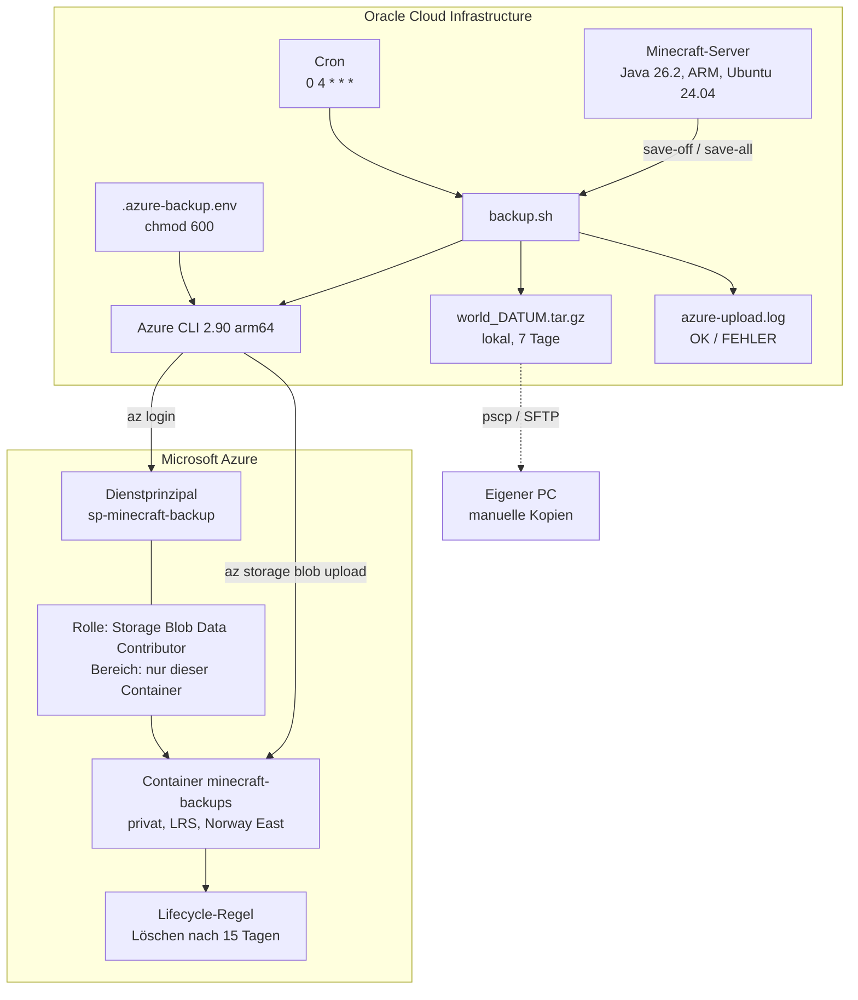
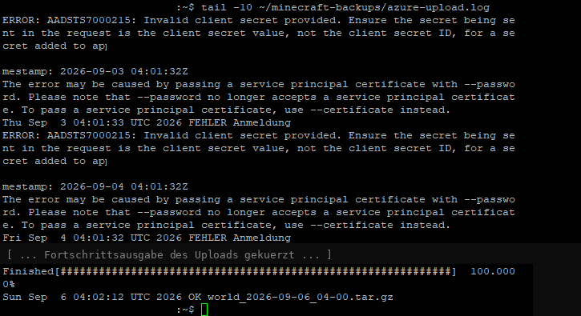
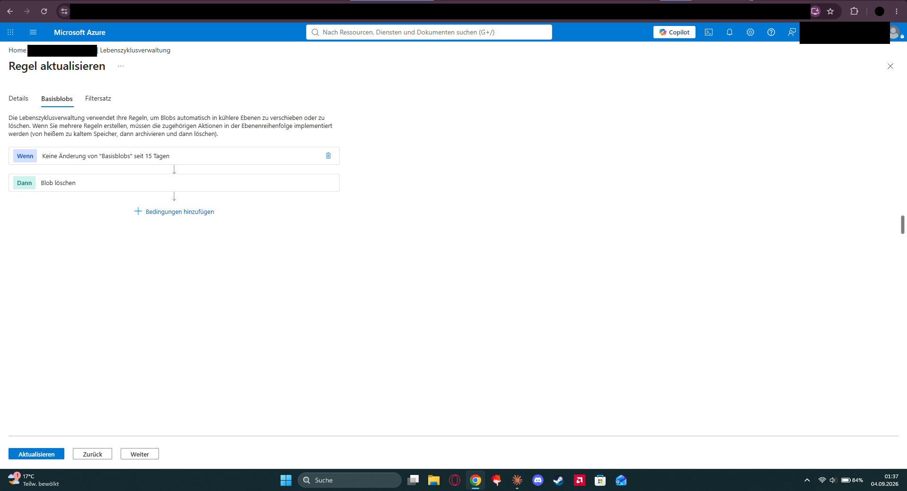
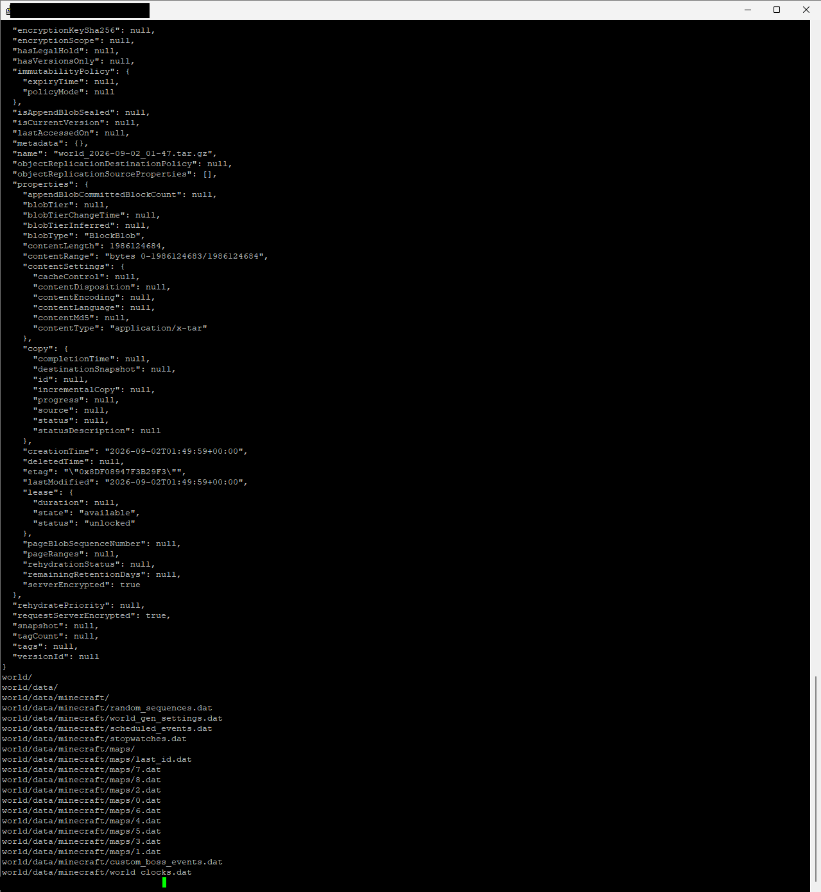

# Offsite-Backup eines Minecraft-Servers von Oracle Cloud nach Azure Blob Storage

Oracle hat mein Konto gesperrt. Sechs Tage lang kam ich weder an den Server noch an die Backups, weil beide am selben Ort lagen. Danach habe ich das Backup zu einem zweiten Anbieter geschoben.

Privates Projekt, acht Spieler. Klein, aber echt kaputtgegangen.

## Das Problem

Seit dem 15.08.2026 läuft ein Minecraft-Server (Java 26.2) für acht Freunde auf einer Always-Free-Instanz bei Oracle Cloud. ARM, Ubuntu 24.04, selbst aufgesetzt. Ein nächtliches Backup gab es schon: Cron um 4 Uhr, Welt als `tar.gz`, sieben Tage Aufbewahrung. Alles auf derselben Instanz.

Am 21.08.2026 sperrte Oracle das Konto ohne Vorwarnung. Server nicht erreichbar, Web-Konsole nicht erreichbar, Backups nicht erreichbar. Außerhalb lag nur eine lokale Kopie vom 18.08. mit 427 MB, die Welt war längst größer. Am 26.08. hat Oracle das Konto von selbst wieder freigeschaltet. Sonst wären mehrere Tage Spielfortschritt weg gewesen.

> Ein Backup beim selben Anbieter wie das System ist kein Backup. Eine Kontosperre nimmt dir beides gleichzeitig.

## Die Lösung

Jedes nächtliche Archiv geht zusätzlich nach Azure Blob Storage. Anderer Anbieter, eigene Anmeldung, eigene Rechnung.

| Ebene | Ort | Aufbewahrung |
|---|---|---|
| 1 | Lokal auf der Oracle-Instanz | 7 Tage |
| 2 | Azure Blob Storage | 15 Tage, per Lifecycle-Regel |
| 3 | Manuelle Kopien auf dem eigenen PC | nach Bedarf |

Ebene 1 fängt das kaputte Update oder die gelöschte Basis ab. Ebene 2 fängt den Fall vom August ab. Ebene 3 greift, wenn beide Cloudkonten gleichzeitig nicht erreichbar sind.

## Architektur



## Aufbau

1. Speicherkonto in Norway East, LRS, StorageV2. Darin der Container `minecraft-backups`, privat, öffentlicher Blobzugriff aus.
2. App-Registrierung `sp-minecraft-backup` in Entra ID, Clientschlüssel mit 24 Monaten Laufzeit.
3. Rolle `Storage Blob Data Contributor` auf dem Container, nicht auf dem Speicherkonto.
4. Azure CLI auf dem Server, arm64 kommt direkt aus dem Microsoft-Repo.
5. Zugangsdaten in `/home/ubuntu/.azure-backup.env`, Muster siehe [`.env.example`](.env.example), danach `chmod 600`.
6. Upload-Block ans bestehende `backup.sh` hängen, siehe [`scripts/backup.sh`](scripts/backup.sh).
7. Lifecycle-Regel `delete-old-backups`: Präfix `minecraft-backups/`, keine Änderung seit 15 Tagen, Blob löschen.
8. Restore testen.

Jeder Schritt mit Klickweg und Befehlen steht in [`docs/SETUP.md`](docs/SETUP.md).

## Warum es so gebaut ist

**Dienstprinzipal statt Speicherkonto-Schlüssel.** Der Kontoschlüssel darf alles im ganzen Speicherkonto und liegt dauerhaft auf einem Server, der offen im Netz steht. Der Dienstprinzipal ist eine eigene Identität mit genau einer Berechtigung. Wird der Server übernommen, kommt der Angreifer an einen Container mit Minecraft-Archiven und sonst nichts.

**Rolle auf dem Container, nicht auf dem Speicherkonto.** Azure erlaubt beides, auf Kontoebene wäre es ein Klick weniger. Nur hätte der Server dann automatisch Zugriff auf jeden Container, der später dazukommt. Berechtigungen wachsen sonst still mit.

**Voller Pfad `/usr/bin/az` im Skript.** Cron startet mit minimalem `PATH`. Ein Skript, das interaktiv läuft, scheitert dort mit `az: command not found`.

**Logfile mit OK und FEHLER pro Lauf.** Ein Upload, der stillschweigend scheitert, ist gefährlicher als gar keiner, weil man sich in Sicherheit wiegt. Das Skript schreibt pro Lauf eine Zeile mit Zeitstempel und leitet `stderr` der Azure-Befehle in dieselbe Datei. Anmeldefehler und Upload-Fehler stehen getrennt drin.

**Secret beim Einrichten über `read -rsp` einlesen.** Steht es direkt im Befehl, landet es in `~/.bash_history`:

```bash
read -rsp "Client Secret: " AZ_SECRET && echo
az login --service-principal -u "<APP-ID>" -p "$AZ_SECRET" --tenant "<TENANT-ID>"
```

In der History steht danach `"$AZ_SECRET"`, nicht der Wert.

**15 Tage statt 30.** Ein Archiv liegt bei knapp 2 GB. 15 Stände sind rund 30 GB statt 60. Der Preis ist das Rückholfenster: fällt ein Schaden erst nach zwei Wochen auf, ist auch der letzte saubere Stand weg. Bei acht aktiven Spielern merkt man fehlende Bauten innerhalb von Tagen, bei selteneren Zugriffen wäre die Rechnung anders.

**Norway East, nicht Germany West Central.** Das Abonnement `Azure for Students` hat eine Deny-Richtlinie (`sys.regionrestriction`) und lässt nur fünf Regionen zu:

```
Resource was disallowed by Azure: This policy maintains a set of best
available regions where your subscription can deploy resources.
(Code: RequestDisallowedByAzure)
```

Für ein privates Backup ist der Ort innerhalb der EU egal, produktiv wäre die Region eine bewusste Entscheidung wegen Latenz und Datenhaltung. Dieselbe Richtlinie plus fehlendes vCPU-Kontingent blockiert in dem Abo übrigens jede VM. Storage braucht kein Kontingent, deshalb geht dieser Weg trotzdem.

## Nachweise

Zugangsdaten und Kennnummern auf den Bildern sind geschwärzt.


Die Rolle "Mitwirkender an Storage-Blobdaten" hängt am Dienstprinzipal mit dem Bereich "Diese Ressource", also am Container.


`"type": "servicePrincipal"` zeigt, dass sich der Server nicht mit einem Benutzerkonto anmeldet.


Die hochgeladenen Welt-Archive mit Größe und Zeitstempel.



Auszug aus `azure-upload.log`: die drei Fehlnächte und der automatische Lauf danach.



Löschen nach 15 Tagen, Präfix auf den Container begrenzt.



`tar -tzf` auf dem aus Azure geholten Archiv. Der Weg zurück funktioniert.

## Betriebserfahrung: der stille Ausfall

Zwei Nächte nach der Inbetriebnahme lud der Cronjob nichts mehr hoch. Aufgefallen ist es nur, weil im Container das Archiv des Vortags fehlte. Lokal sah alles normal aus, gepackt wurde weiter.

```
ERROR: AADSTS7000215: Invalid client secret provided.
Wed Sep  2 04:01:36 UTC 2026 FEHLER Anmeldung
Thu Sep  3 04:01:33 UTC 2026 FEHLER Anmeldung
Fri Sep  4 04:01:32 UTC 2026 FEHLER Anmeldung
```

Beim Aufräumen im Portal hatte ich einen Clientschlüssel gelöscht, der noch in der env-Datei auf dem Server stand. Ab dem nächsten Lauf scheiterte die Anmeldung, alles davor lief normal weiter. Behoben mit neuem Schlüssel, neuem `AZ_SECRET` und dem nachgereichten Archiv.

Ohne Logfile hätte das wochenlang so bleiben können. Betriebsregel daraus: vor dem Löschen eines Clientschlüssels prüfen, ob er irgendwo auf einem Server liegt.

## Was hängen geblieben ist

Ein Backup ohne getesteten Restore ist eine Vermutung. Erst der Download aus Azure und das `tar -tzf` haben aus "da liegt eine Datei in der Cloud" ein "ich komme im Ernstfall an meine Welt" gemacht.

Redundanz heißt Unabhängigkeit, nicht Menge. Zwei Kopien am selben Ort sind eine Kopie, das hat der August vorgeführt.

Automatisierung ohne Rückmeldung ist gefährlich. Das Logfile war kein Extra, sondern der Teil, der den Ausfall überhaupt sichtbar gemacht hat.

Und `RequestDisallowedByAzure` klang zuerst nach "geht nicht". Gelesen hieß es "nicht in dieser Region". Das war der Unterschied zwischen Abbruch und einem Klick.

## Einordnung

Privates Projekt mit acht Nutzern und einer Minecraft-Welt, kein Unternehmenssystem. Keine Hochverfügbarkeit, kein Monitoring über das Logfile hinaus, keine eigenen Verschlüsselungsschlüssel.

Technik: Oracle Cloud Infrastructure, Ubuntu 24.04 (ARM), Bash, Cron, GNU tar, screen, Azure Blob Storage, Entra ID, RBAC, Lifecycle Management, Azure CLI.
