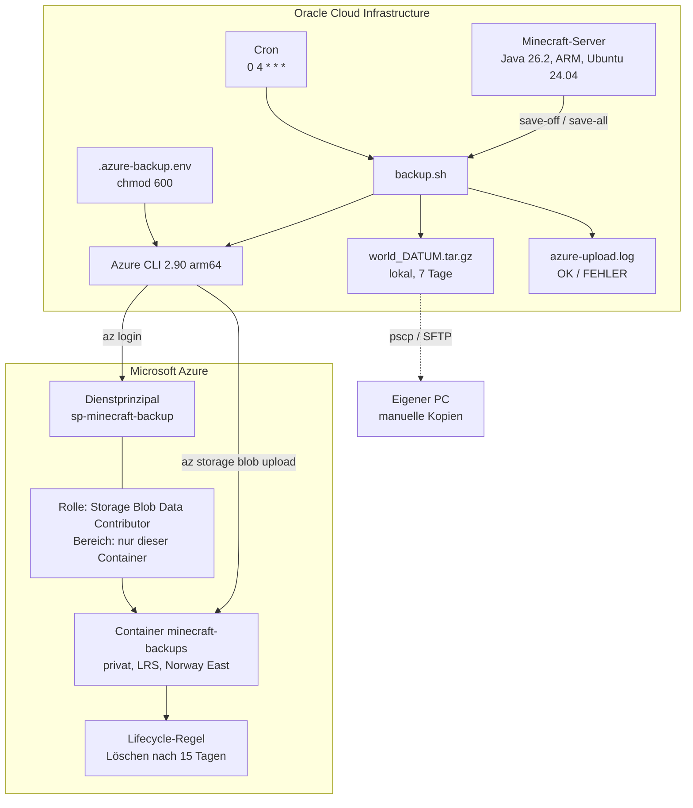

# Offsite-Backup meines Minecraft-Servers von Oracle Cloud nach Azure

Am 21.08.2026 hat Oracle mein Konto gesperrt. Ohne Vorwarnung. Server weg, Web-Konsole weg, und die Backups gleich mit, weil die auf derselben Instanz lagen.

Sechs Tage lang konnte ich nichts machen außer warten. Genau in der Zeit ist mir klar geworden, dass mein Backup keins war.

Privates Projekt, acht Leute spielen drauf. Klein, aber einmal richtig schiefgegangen, und darum geht es hier.

## Was passiert ist

Seit dem 15.08.2026 läuft ein Minecraft-Server (Java 26.2) für acht Freunde bei Oracle Cloud auf einer Always-Free-Instanz. ARM, Ubuntu 24.04, alles selbst aufgesetzt. Ein Backup lief auch schon: Cron um 4 Uhr nachts, Welt als `tar.gz`, sieben Tage aufheben. Sah für mich gut aus. Lag nur alles auf derselben Instanz.

Dann kam die Sperre. Was ich in den sechs Tagen hatte, war eine lokale Kopie vom 18.08. mit 427 MB. Die Welt war da schon deutlich größer, an der Differenz hingen also mehrere Tage Bauen, die es nirgendwo sonst gab. Ich konnte nichts retten, nichts prüfen, nichts neu starten, und den anderen konnte ich auch nur sagen, dass ich es nicht weiß.

Am 26.08. war das Konto plötzlich wieder da, von selbst. Glück gehabt. Wäre es nicht zurückgekommen, wären die Tage weg gewesen.

> Ein Backup beim selben Anbieter wie der Server ist kein Backup. Eine Kontosperre nimmt dir beides auf einmal.

Für den Satz habe ich sechs Tage gebraucht.

## Wie ich es gelöst habe

Jedes Archiv aus der Nacht geht zusätzlich nach Azure Blob Storage. Anderer Anbieter, eigener Login, eigene Rechnung. Wenn Oracle nochmal dichtmacht, komme ich trotzdem an die Welt.

| Ebene | Ort | Aufbewahrung |
|---|---|---|
| 1 | Lokal auf der Oracle-Instanz | 7 Tage |
| 2 | Azure Blob Storage | 15 Tage, per Lifecycle-Regel |
| 3 | Kopien auf meinem PC | nach Bedarf |

Ebene 1 fängt den Alltag ab, kaputtes Update oder gelöschte Basis. Ebene 2 ist genau für den August-Fall. Ebene 3 ist für den Tag, an dem beide Konten gleichzeitig zicken.

## Architektur



## Aufbau

1. Speicherkonto in Norway East, LRS, StorageV2. Darin der Container `minecraft-backups`, privat, öffentlicher Zugriff aus.
2. App-Registrierung `sp-minecraft-backup` in Entra ID, dazu ein Clientschlüssel mit 24 Monaten Laufzeit.
3. Rolle `Storage Blob Data Contributor` auf den Container geben, nicht auf das Speicherkonto.
4. Azure CLI auf den Server. arm64 kommt direkt aus dem Microsoft-Repo.
5. Zugangsdaten nach `/home/ubuntu/.azure-backup.env`, Vorlage steht in [`.env.example`](.env.example), danach `chmod 600`.
6. Upload-Block an das vorhandene `backup.sh` dranhängen, siehe [`scripts/backup.sh`](scripts/backup.sh).
7. Lifecycle-Regel `delete-old-backups`: Präfix `minecraft-backups/`, seit 15 Tagen nicht geändert, Blob löschen.
8. Restore testen.

Der ganze Klickweg mit allen Befehlen steht in [`docs/SETUP.md`](docs/SETUP.md).

## Warum ich es so gemacht habe

**Dienstprinzipal statt Kontoschlüssel.** Der Kontoschlüssel darf alles im ganzen Speicherkonto und würde dauerhaft auf einem Server liegen, der offen im Netz hängt. Der Dienstprinzipal ist eine eigene Identität mit genau einer Berechtigung. Wenn mir jemand den Server übernimmt, kommt er an einen Container mit Minecraft-Archiven und sonst an nichts.

**Rolle auf dem Container, nicht auf dem Speicherkonto.** Beides geht, auf Kontoebene wäre es sogar ein Klick weniger gewesen. Dann hätte der Server aber automatisch Zugriff auf jeden Container, den ich später mal anlege. Sowas wächst still mit, und irgendwann fragt keiner mehr, warum das so ist.

**Voller Pfad `/usr/bin/az` im Skript.** Cron startet mit einem sehr kurzen `PATH`. Von Hand läuft das Skript, im Cron kommt dann `az: command not found`. Klassiker.

**Logfile mit OK und FEHLER pro Lauf.** Ein Upload, der still scheitert, ist schlimmer als gar keiner, weil man sich in Sicherheit wiegt. Das Skript schreibt pro Lauf eine Zeile mit Zeitstempel und schiebt `stderr` der Azure-Befehle in dieselbe Datei. Anmeldefehler und Upload-Fehler stehen getrennt drin, damit ich sehe, wo es hakt.

**Secret beim Einrichten mit `read -rsp` eingeben.** Tippe ich es direkt in den Befehl, steht es danach in `~/.bash_history`:

```bash
read -rsp "Client Secret: " AZ_SECRET && echo
az login --service-principal -u "<APP-ID>" -p "$AZ_SECRET" --tenant "<TENANT-ID>"
```

In der History steht dann `"$AZ_SECRET"` und nicht der Wert.

**15 Tage statt 30.** Ein Archiv ist knapp 2 GB groß. 15 Stände sind rund 30 GB statt 60. Dafür ist mein Rückholfenster kürzer: fällt mir ein Schaden erst nach zwei Wochen auf, ist auch der letzte saubere Stand weg. Bei acht Leuten, die regelmäßig spielen, merkt man fehlende Bauten aber nach ein paar Tagen. Wäre der Server ruhiger, würde ich anders rechnen.

**Norway East statt Germany West Central.** Mein Abo `Azure for Students` hat eine Deny-Richtlinie (`sys.regionrestriction`) und lässt nur fünf Regionen zu:

```
Resource was disallowed by Azure: This policy maintains a set of best
available regions where your subscription can deploy resources.
(Code: RequestDisallowedByAzure)
```

Bei einem privaten Backup ist mir egal, wo in der EU die Daten liegen. Produktiv würde man die Region bewusst wählen, wegen Latenz und Datenhaltung. Dieselbe Richtlinie plus fehlendes vCPU-Kontingent blockiert in dem Abo übrigens jede VM. Storage braucht kein Kontingent, deshalb geht dieser Weg trotzdem.

## Nachweise

Zugangsdaten und Kennnummern auf den Bildern sind geschwärzt.


Die Rolle "Mitwirkender an Storage-Blobdaten" hängt am Dienstprinzipal, Bereich "Diese Ressource", also am Container.


`"type": "servicePrincipal"` zeigt, dass sich der Server nicht mit meinem Benutzerkonto anmeldet.


Die hochgeladenen Welt-Archive mit Größe und Zeitstempel.


Auszug aus `azure-upload.log`. Die drei Nächte, in denen nichts ging, und danach der automatische Lauf.


Löschen nach 15 Tagen, nur für diesen Container.


`tar -tzf` auf dem Archiv, das ich aus Azure geholt habe. Der Weg zurück geht also.

## Was mal schiefgelaufen ist

Zwei Nächte nach dem Einrichten hat der Cronjob nichts mehr hochgeladen. Gemerkt habe ich es nur, weil im Container das Archiv vom Vortag fehlte. Lokal sah alles normal aus, gepackt wurde brav weiter.

```
ERROR: AADSTS7000215: Invalid client secret provided.
Wed Sep  2 04:01:36 UTC 2026 FEHLER Anmeldung
Thu Sep  3 04:01:33 UTC 2026 FEHLER Anmeldung
Fri Sep  4 04:01:32 UTC 2026 FEHLER Anmeldung
```

Ich hatte im Portal aufgeräumt und dabei einen Clientschlüssel gelöscht, der noch in der env-Datei auf dem Server stand. Mein Fehler. Ab dem nächsten Lauf ging die Anmeldung nicht mehr, alles davor lief normal weiter. Neuen Schlüssel angelegt, `AZ_SECRET` getauscht, das fehlende Archiv nachgeschoben.

Ohne Logfile hätte ich das wochenlang nicht gemerkt. Regel für mich: bevor ich einen Clientschlüssel lösche, prüfen, ob er irgendwo auf einem Server hinterlegt ist.

## Was ich mitgenommen habe

Ein Backup ohne getesteten Restore ist nur eine Vermutung. Erst der Download aus Azure und das `tar -tzf` haben aus "da liegt eine Datei in der Cloud" ein "ich komme im Ernstfall an meine Welt" gemacht.

Redundanz heißt unabhängig, nicht viel. Zwei Kopien am selben Ort sind eine Kopie. Der August hat mir das ziemlich deutlich gezeigt.

Automatik ohne Rückmeldung ist gefährlich. Das Logfile war kein Extra, sondern der Teil, der den Ausfall überhaupt sichtbar gemacht hat.

Und `RequestDisallowedByAzure` klang für mich erst nach "geht nicht". Gelesen hieß es "nicht in dieser Region". Zwischen aufhören und weitermachen lag ein Klick.

## Einordnung

Privates Projekt mit acht Leuten und einer Minecraft-Welt, kein Firmensystem. Keine Hochverfügbarkeit, kein Monitoring außer dem Logfile, keine eigenen Verschlüsselungsschlüssel. Was hier steht, ist kein fertiges Konzept, sondern das, was ich nach einem echten Ausfall gebaut und danach auch getestet habe.

Technik: Oracle Cloud Infrastructure, Ubuntu 24.04 (ARM), Bash, Cron, GNU tar, screen, Azure Blob Storage, Entra ID, RBAC, Lifecycle Management, Azure CLI.
